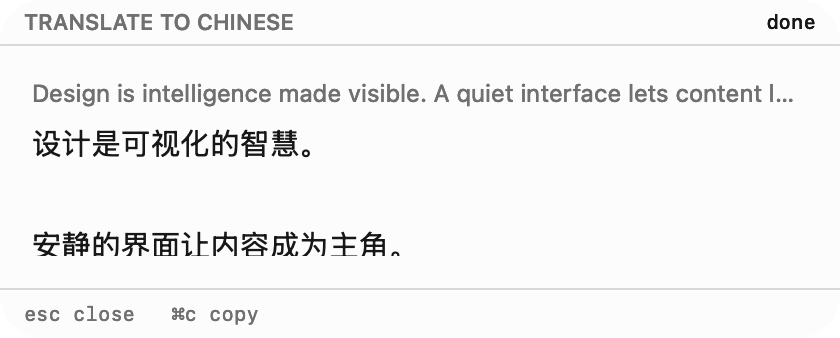

<div align="center">

# yiyi

**A quiet macOS menu-bar translator for the text you select.**

[Website](https://misterbrookt.github.io/yiyi/) · [Install](#install)

<picture>
  <source media="(prefers-color-scheme: dark)" srcset="docs/site/assets/result-dark.png">
  
</picture>

</div>

## About

yiyi translates selected text without switching apps. Bring an OpenAI-compatible endpoint, save your prompts as commands, and invoke them with a keyboard shortcut, Hyper Key, or an experimental mouse/trackpad gesture. It uses native macOS frameworks, with no runtime dependencies or Dock icon.

This is a source-build release, not a notarized download. Text is sent to your chosen endpoint; yiyi is not inherently offline.

## Install

Requires macOS 14+ and a Swift 6 toolchain (current Xcode Command Line Tools or Xcode).

```sh
git clone https://github.com/MisterBrookT/yiyi.git
cd yiyi
./install.sh
```

The installer builds, signs, installs, and opens yiyi. It uses your Developer ID if available, otherwise a reusable local signing identity. Local signing is not Apple notarization.

## First use

1. Open **yiyi → Settings → Translation**. Enter your **Base URL**, **API key**, and **model**, then **Save**.
2. Enable yiyi in **System Settings → Privacy & Security → Accessibility** for selected-text capture. Without it, yiyi uses clipboard text.
3. Select some text and press **⌘−** to translate into Chinese, or **⌘⇧−** for English. Change these in **Commands**.

The floating panel shows the result. **Esc** closes it; **⌘C** copies it. Automatic copying is optional in **General**.

## Commands and inputs

Each command has a name, shortcut, and prompt. Changes remain drafts until **Save** (or **⌘S**). Cancel, closing Settings, and quitting protect unsaved work with a confirmation. **Delete…** is beside the command picker.

- `{selection}` / `{input}` — selected text, falling back to the clipboard when selection is unavailable.
- `{clipboard}` / `{copy}` — clipboard text from before capture, without synthesizing Copy for clipboard-only prompts.
- Insert buttons add highlighted tokens at the cursor. Unknown tokens such as `{selecton}` show an error.

**Keyboard** records ordinary modifier combinations. **Hyper Key** uses a chosen right-side modifier or an existing external **⌃⌥⇧⌘** remap. Selecting External Hyper does not remap Caps Lock or change system keyboard settings.

## Mouse and trackpad

In **General**, opt into **Option + click-and-hold** and choose its command. Hold **⌥** and the primary button for roughly half a second, then release without dragging.

The experimental gesture uses the selection at press time when Accessibility can read it quickly; otherwise it uses the clipboard. Dragging, releasing Option, or another button cancels it. It never consumes normal pointer events. Input Monitoring permission may also be required. It stays **off by default**.

## Configuration and privacy

Settings live in `~/.config/yiyi/config.json`. Saved files are owner-readable/writable only; inline API keys are stored as plaintext, not in Keychain. Keys can also come from environment variables or local key files. Existing named connections and command overrides remain supported and are preserved by Settings.

Changing a server’s origin requires re-entering the API key or explicitly confirming its reuse. Prompt and clipboard text are not written to diagnostic logs.

[Configuration details](docs/configuration.md) · [Development and checks](docs/development.md)
