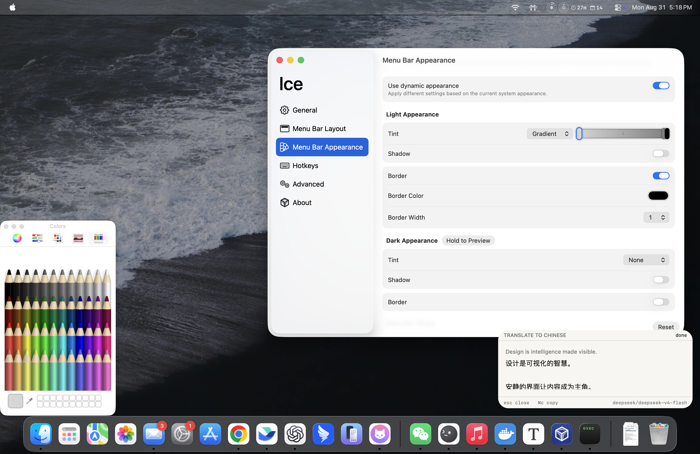
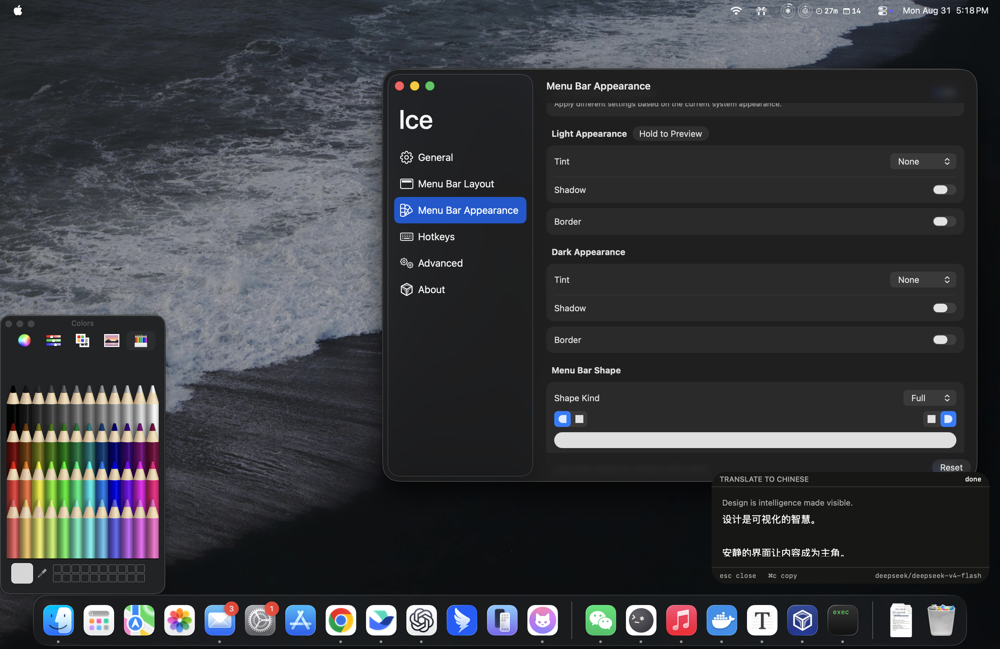

<div align="center">

# yiyi

**A native macOS menu-bar translator, available from any app with one hotkey.**

</div>

<div align="center">
  
  
</div>

## About

yiyi captures selected text, sends it to an OpenAI-compatible provider, copies the translation, and shows it in a quiet floating panel. It is an LSUIElement app with no Dock icon, uses only macOS frameworks, and supports multiple named commands and providers.

## Install

Requires macOS 14+ and Swift 6.

```sh
./install.sh
```

The installer builds a release app, signs it with a stable identity, installs it to `/Applications` (or `~/Applications` without write access), and launches it. It prefers `YIYI_CODESIGN_IDENTITY`, then an existing Developer ID Application identity, and otherwise creates and reuses a local `yiyi Local Signing` identity in the login keychain.

## First use

On first launch a small panel explains the hotkeys and offers to enable Accessibility:
press <kbd>⏎</kbd> to open **Privacy & Security → Accessibility** and switch yiyi on, or
<kbd>esc</kbd> to skip. The menu keeps an **Enable Accessibility…** item until it is granted.

### Permissions survive updates

Because yiyi keeps the same signing identity, macOS recognizes rebuilt and reinstalled copies as the same app, so an existing Accessibility grant persists across updates. Accessibility only needs to be granted again when the signing identity itself changes (for example, the one-time move from an older ad-hoc build to stable signing): open **System Settings → Privacy & Security → Accessibility**, enable **yiyi**, and relaunch it.

Accessibility is optional and only widens the input:

| Accessibility | Input yiyi translates |
| --- | --- |
| Granted | The selection in the frontmost app (read with a synthetic Copy), else the clipboard |
| Not granted | The clipboard — copy the text, then press the hotkey |

Then press <kbd>⌘</kbd><kbd>-</kbd>. The panel shows `working`, then `done`, and the result is
copied automatically. <kbd>esc</kbd> closes it; <kbd>⌘</kbd><kbd>c</kbd> copies the selectable result.

Global hotkeys are registered with Carbon, so they respond to real key presses only —
synthetic `System Events` keystrokes do not reach them.

## Settings and configuration

Choose **Settings…** from the menu (or press <kbd>⌘</kbd><kbd>,</kbd>) to configure yiyi without editing JSON. Changes are saved immediately. The window lets you choose DeepSeek or Qwen as the default, set each provider's model, API key, optional temperature, and reasoning effort, and shows where its key resolves from without revealing it.

Each shortcut has an editable name, provider/model and reasoning-effort overrides, prompt template, and a click-to-record hotkey. Press Escape while recording to cancel or Delete to clear it. Prompts must contain `{selection}` or `{input}`; invalid templates are marked inline. Commands can be added and removed.

On first launch yiyi creates `~/.config/yiyi/config.json` with these exact defaults:

```json
{
  "autoCopy" : true,
  "commands" : [
    {
      "hotkey" : "cmd+-",
      "name" : "Translate to Chinese",
      "prompt" : "Translate the following into Chinese. Output only the translation, no explanation.\n\n{selection}"
    },
    {
      "hotkey" : "cmd+shift+-",
      "name" : "Translate to English",
      "prompt" : "Translate the following into English. Output only the translation, no explanation.\n\n{selection}"
    }
  ],
  "defaultProvider" : "deepseek",
  "providers" : {
    "deepseek" : {
      "apiKeyEnv" : "DEEPSEEK_API_KEY",
      "baseURL" : "https://api.deepseek.com/v1",
      "model" : "deepseek-v4-flash",
      "reasoningEffort" : "none"
    },
    "qwen" : {
      "apiKeyEnv" : "DASHSCOPE_API_KEY",
      "baseURL" : "https://dashscope.aliyuncs.com/compatible-mode/v1",
      "model" : "qwen-plus",
      "reasoningEffort" : "none"
    }
  },
  "superKey" : "none"
}
```

A command's optional `provider`, `model`, and `reasoningEffort` override the selected default. Every prompt must contain `{selection}` or `{input}`. Standard hotkeys accept `cmd`, `shift`, `ctrl`, and `opt` plus a key, such as `ctrl+opt+t`.

The **Superkey** setting can turn Right Command, Right Option, or Right Control into a leader key. Bind commands with syntax such as `super+t`; while the leader is held, yiyi consumes that bound key instead of passing it to the frontmost app. Superkey bindings require yiyi to be enabled in **Privacy & Security → Accessibility**. If access is unavailable, the Settings status explains why and normal Carbon shortcuts and clipboard-only translation keep working.

**Edit config…** opens the underlying file; **Reload config** applies external changes. Existing custom providers remain supported when loaded, although the shipped provider set is DeepSeek and Qwen.

Provider key lookup order is `providers.<name>.apiKey`, its `apiKeyEnv` process environment variable, the same variable in `~/.config/yiyi/.env`, then `~/.config/yiyi/apikey` for the default provider only. Keys are never displayed or logged. An empty temperature omits `temperature` from requests; reasoning effort `none` omits `reasoning_effort`.

## Providers

| Provider | Default model | Key setting |
| --- | --- | --- |
| DeepSeek | `deepseek-v4-flash` | `DEEPSEEK_API_KEY` |
| Qwen / DashScope | `qwen-plus` | `DASHSCOPE_API_KEY` |

To enable either provider for a Finder/login-launched app, add `DASHSCOPE_API_KEY=...` or `DEEPSEEK_API_KEY=...` to `~/.config/yiyi/.env`. Alternatively, enter the key securely in Settings. Shell-exported variables work when yiyi is launched from that shell.

## Build and smoke test

```sh
swift test
swift build -c release
.build/release/yiyi --translate "hello world"
```
